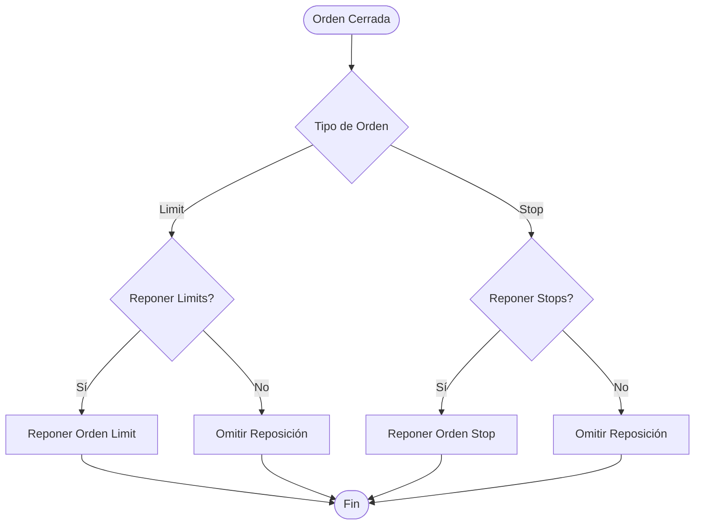
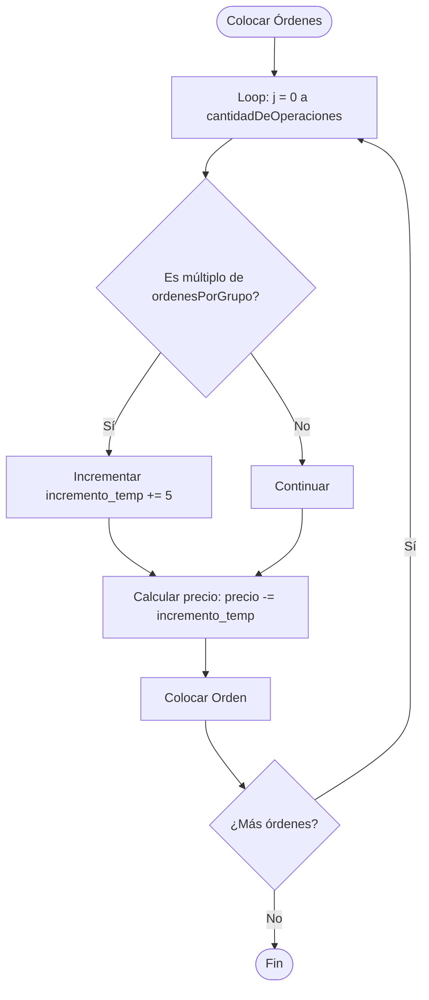
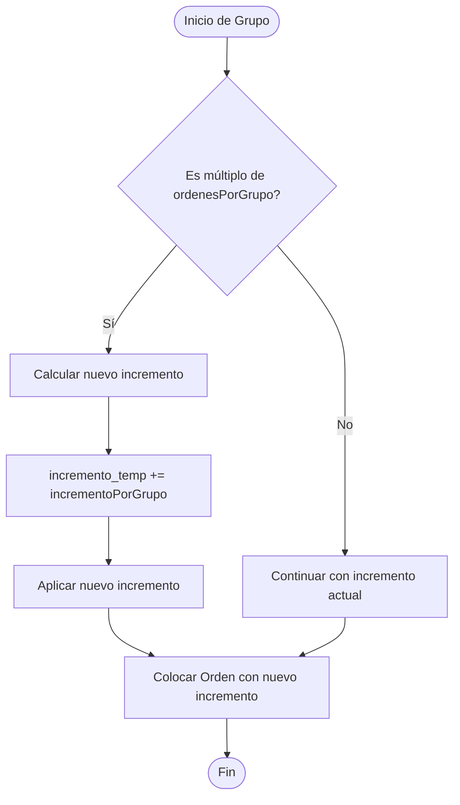
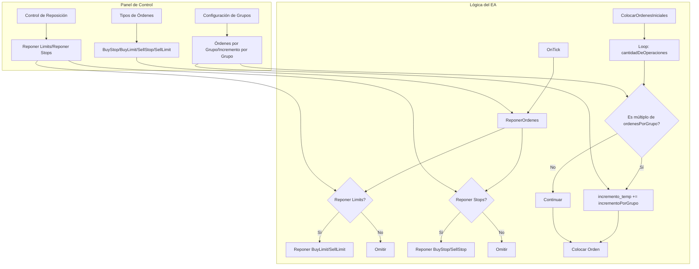

# Plan de Implementación - Nuevas Funcionalidades

## 📋 Resumen Ejecutivo

Este documento describe el plan de implementación para agregar tres nuevas funcionalidades al Expert Advisor Dejavu:

1. **Control de Reposición de Órdenes**: Activar/desactivar reposición de órdenes Limit y Stop por separado
2. **Configuración de Grupos de Órdenes**: Modificar el número de órdenes por grupo
3. **Configuración de Incremento por Grupo**: Modificar la distancia entre órdenes de cada grupo

---

## 🎯 Objetivo 1: Control de Reposición de Órdenes

### Descripción
Permitir activar/desactivar la reposición automática de órdenes Limit y Stop de forma independiente desde el panel de control.

### Análisis Actual
- La función `ReponerOrdenes()` repone todas las órdenes sin distinción
- No hay control separado para Limit vs Stop
- Las órdenes Limit son: BuyLimit (comment "2") y SellLimit (comment "3")
- Las órdenes Stop son: BuyStop (comment "4") y SellStop (comment "5")

### Especificaciones Técnicas

#### 1.1 Variables Globales Nuevas
```mql5
// Variables globales para control de reposición
bool g_reponerLimits = true;   // Activar reposición de órdenes Limit
bool g_reponerStops = true;    // Activar reposición de órdenes Stop
```

#### 1.2 Parámetros Input (Opcional)
```mql5
input string ConfigReposicion = "Configuracion de Reposicion";
input bool reponerLimits = true;   // Reponer órdenes Limit automáticamente
input bool reponerStops = true;    // Reponer órdenes Stop automáticamente
```

#### 1.3 Modificaciones en `ReponerOrdenes()`
- Agregar verificación antes de reponer órdenes Limit (comment "2" y "3")
- Agregar verificación antes de reponer órdenes Stop (comment "4" y "5")

#### 1.4 Elementos del Panel de Control
- Agregar dos nuevos toggles en el panel:
  - "Reponer Limits: ON/OFF"
  - "Reponer Stops: ON/OFF"
- Posición: Después de los toggles de tipos de órdenes
- Funcionalidad: Similar a los toggles existentes

### Diagrama de Flujo



### Archivos a Modificar
- `Dejavu.mq5`:
  - Agregar variables globales (línea ~115)
  - Agregar parámetros input (línea ~173)
  - Modificar `ReponerOrdenes()` (línea ~1427)
  - Modificar `CrearPanelControl()` (línea ~1630)
  - Modificar `ActualizarPanelControl()` (línea ~1730)
  - Modificar `OnChartEvent()` (línea ~1904)

---

## 🎯 Objetivo 2: Configuración de Número de Órdenes por Grupo

### Descripción
Permitir modificar cuántas órdenes se colocan antes de aumentar el incremento. Actualmente es fijo en 15 órdenes.

### Análisis Actual
- En `ColocarOrdenesIniciales()`: `if(j % 15 == 0 && j != 0)`
- El número 15 está hardcodeado
- Se aplica tanto para órdenes hacia abajo como hacia arriba

### Especificaciones Técnicas

#### 2.1 Variables Globales Nuevas
```mql5
// Variables globales para configuración de grupos
int g_ordenesPorGrupo = 15;  // Número de órdenes antes de aumentar incremento
```

#### 2.2 Parámetros Input
```mql5
input string ConfigGrupos = "Configuracion de Grupos";
input int ordenesPorGrupo = 15;  // Número de órdenes por grupo antes de aumentar incremento
```

#### 2.3 Modificaciones en `ColocarOrdenesIniciales()`
- Reemplazar `j % 15` por `j % g_ordenesPorGrupo`
- Reemplazar `i % 15` por `i % g_ordenesPorGrupo`

#### 2.4 Elementos del Panel de Control
- Agregar campo de entrada numérica:
  - "Órdenes por Grupo: [15]"
  - Botón "Aplicar" para confirmar cambios
  - Validación: mínimo 1, máximo 100

### Diagrama de Flujo



### Archivos a Modificar
- `Dejavu.mq5`:
  - Agregar variable global (línea ~115)
  - Agregar parámetro input (línea ~173)
  - Modificar `ColocarOrdenesIniciales()` (líneas ~1343, ~1375)
  - Modificar `CrearPanelControl()` para agregar campo de entrada
  - Modificar `OnChartEvent()` para manejar el campo de entrada

---

## 🎯 Objetivo 3: Configuración de Incremento por Grupo

### Descripción
Permitir modificar el incremento adicional que se suma a cada grupo. Actualmente es fijo en +5 puntos cada 15 órdenes.

### Análisis Actual
- En `ColocarOrdenesIniciales()`: `incremento_temp += 5`
- El valor 5 está hardcodeado
- Se aplica cada vez que se completa un grupo

### Especificaciones Técnicas

#### 3.1 Variables Globales Nuevas
```mql5
// Variables globales para incremento por grupo
int g_incrementoPorGrupo = 5;  // Incremento adicional por cada grupo
```

#### 3.2 Parámetros Input
```mql5
input int incrementoPorGrupo = 5;  // Incremento adicional por cada grupo (en puntos)
```

#### 3.3 Modificaciones en `ColocarOrdenesIniciales()`
- Reemplazar `incremento_temp += 5` por `incremento_temp += g_incrementoPorGrupo`
- Aplicar en ambos loops (hacia abajo y hacia arriba)

#### 3.4 Elementos del Panel de Control
- Agregar campo de entrada numérica:
  - "Incremento por Grupo: [5]"
  - Botón "Aplicar" para confirmar cambios
  - Validación: mínimo 1, máximo 50 puntos

### Diagrama de Flujo



### Archivos a Modificar
- `Dejavu.mq5`:
  - Agregar variable global (línea ~115)
  - Agregar parámetro input (línea ~173)
  - Modificar `ColocarOrdenesIniciales()` (líneas ~1345, ~1377)
  - Modificar `CrearPanelControl()` para agregar campo de entrada
  - Modificar `OnChartEvent()` para manejar el campo de entrada

---

## 🎨 Diseño del Panel de Control Actualizado

### Estructura Visual Propuesta

```
┌─────────────────────────────────────┐
│  Control de Ordenes                 │
├─────────────────────────────────────┤
│  BuyStop:    [OFF]  A:0 P:0         │
│  BuyLimit:   [ON]   A:0 P:0         │
│  SellStop:   [OFF]  A:0 P:0         │
│  SellLimit:  [ON]   A:0 P:0         │
├─────────────────────────────────────┤
│  Reponer Limits:  [ON]              │
│  Reponer Stops:   [ON]              │
├─────────────────────────────────────┤
│  Órdenes por Grupo: [15]            │
│  Incremento por Grupo: [5]           │
├─────────────────────────────────────┤
│  [Aplicar]  [Eliminar]              │
└─────────────────────────────────────┘
```

### Dimensiones Ajustadas
- Ancho actual: 290px
- Ancho propuesto: 320px (para acomodar nuevos elementos)
- Altura actual: 200px
- Altura propuesta: 280px (para acomodar nuevos elementos)

---

## 📝 Plan de Implementación por Fases

### Fase 1: Control de Reposición de Órdenes (Prioridad Alta)

**Duración estimada**: 2-3 horas

#### Tareas:
1. ✅ Agregar variables globales `g_reponerLimits` y `g_reponerStops`
2. ✅ Agregar parámetros input `reponerLimits` y `reponerStops`
3. ✅ Inicializar variables en `OnInit()`
4. ✅ Modificar `ReponerOrdenes()` para verificar flags antes de reponer
5. ✅ Agregar toggles en `CrearPanelControl()`
6. ✅ Agregar manejo de eventos en `OnChartEvent()`
7. ✅ Actualizar `ActualizarPanelControl()` para mostrar estado
8. ✅ Probar reposición de Limits y Stops por separado

#### Criterios de Aceptación:
- [ ] Los toggles aparecen en el panel de control
- [ ] Al desactivar "Reponer Limits", las órdenes Limit no se reponen
- [ ] Al desactivar "Reponer Stops", las órdenes Stop no se reponen
- [ ] Los cambios se aplican inmediatamente sin reiniciar el EA

---

### Fase 2: Configuración de Número de Órdenes por Grupo (Prioridad Media)

**Duración estimada**: 2-3 horas

#### Tareas:
1. ✅ Agregar variable global `g_ordenesPorGrupo`
2. ✅ Agregar parámetro input `ordenesPorGrupo`
3. ✅ Inicializar variable en `OnInit()`
4. ✅ Modificar `ColocarOrdenesIniciales()` para usar variable en lugar de 15
5. ✅ Agregar campo de entrada numérica en `CrearPanelControl()`
6. ✅ Agregar validación (mínimo 1, máximo 100)
7. ✅ Agregar manejo de eventos en `OnChartEvent()`
8. ✅ Agregar botón "Aplicar" para confirmar cambios
9. ✅ Probar con diferentes valores (5, 10, 20, 30)

#### Criterios de Aceptación:
- [ ] El campo de entrada aparece en el panel
- [ ] Se puede modificar el valor desde el panel
- [ ] El valor se valida (mínimo 1, máximo 100)
- [ ] Al aplicar, las nuevas órdenes usan el nuevo valor
- [ ] Las órdenes existentes no se modifican (solo nuevas)

---

### Fase 3: Configuración de Incremento por Grupo (Prioridad Media)

**Duración estimada**: 2-3 horas

#### Tareas:
1. ✅ Agregar variable global `g_incrementoPorGrupo`
2. ✅ Agregar parámetro input `incrementoPorGrupo`
3. ✅ Inicializar variable en `OnInit()`
4. ✅ Modificar `ColocarOrdenesIniciales()` para usar variable en lugar de 5
5. ✅ Agregar campo de entrada numérica en `CrearPanelControl()`
6. ✅ Agregar validación (mínimo 1, máximo 50)
7. ✅ Agregar manejo de eventos en `OnChartEvent()`
8. ✅ Agregar botón "Aplicar" para confirmar cambios
9. ✅ Probar con diferentes valores (3, 5, 10, 15)

#### Criterios de Aceptación:
- [ ] El campo de entrada aparece en el panel
- [ ] Se puede modificar el valor desde el panel
- [ ] El valor se valida (mínimo 1, máximo 50)
- [ ] Al aplicar, las nuevas órdenes usan el nuevo incremento
- [ ] El incremento se suma correctamente en cada grupo

---

### Fase 4: Integración y Pruebas (Prioridad Alta)

**Duración estimada**: 2-3 horas

#### Tareas:
1. ✅ Integrar todas las funcionalidades
2. ✅ Ajustar diseño del panel para acomodar todos los elementos
3. ✅ Probar interacciones entre funcionalidades
4. ✅ Validar que no se rompan funcionalidades existentes
5. ✅ Probar en diferentes escenarios:
   - Cambiar valores mientras hay órdenes activas
   - Desactivar reposición mientras hay órdenes pendientes
   - Cambiar número de órdenes por grupo
   - Cambiar incremento por grupo
6. ✅ Documentar cambios en el código
7. ✅ Actualizar README.md con nuevas funcionalidades

#### Criterios de Aceptación:
- [ ] Todas las funcionalidades trabajan juntas sin conflictos
- [ ] El panel se ve bien y es usable
- [ ] No hay errores de compilación
- [ ] No se rompen funcionalidades existentes
- [ ] La documentación está actualizada

---

## 🔧 Detalles de Implementación Técnica

### 1. Modificación de `ReponerOrdenes()`

**Código actual:**
```mql5
// BUYLIMIT
else if(StringFind(order.comment, "2") == 0 && CheckMoneyForTrade(_Symbol, lot, POSITION_TYPE_BUY))
{
    trade.BuyLimit(...);
}
```

**Código propuesto:**
```mql5
// BUYLIMIT
else if(StringFind(order.comment, "2") == 0 && CheckMoneyForTrade(_Symbol, lot, POSITION_TYPE_BUY))
{
    if(g_reponerLimits)  // Verificar si reposición de Limits está activada
    {
        trade.BuyLimit(...);
    }
}
```

**Aplicar mismo patrón para:**
- SellLimit (comment "3")
- BuyStop (comment "4")
- SellStop (comment "5")

---

### 2. Modificación de `ColocarOrdenesIniciales()`

**Código actual:**
```mql5
for(int j = 0; j < cantidadDeOperaciones; j++)
{
    if(j % 15 == 0 && j != 0)
    {
        incremento_temp += 5;
    }
    // ...
}
```

**Código propuesto:**
```mql5
for(int j = 0; j < cantidadDeOperaciones; j++)
{
    if(j % g_ordenesPorGrupo == 0 && j != 0)
    {
        incremento_temp += g_incrementoPorGrupo;
    }
    // ...
}
```

---

### 3. Nuevos Elementos en `CrearPanelControl()`

**Agregar después de los toggles de tipos de órdenes:**

```mql5
// Toggle Reponer Limits
int yPosReponer = PANEL_CONTROL_Y + 120;
ObjectCreate(0, "BtnReponerLimits", OBJ_BUTTON, 0, 0, 0);
ObjectSetInteger(0, "BtnReponerLimits", OBJPROP_XDISTANCE, PANEL_CONTROL_X + 10);
ObjectSetInteger(0, "BtnReponerLimits", OBJPROP_YDISTANCE, yPosReponer);
ObjectSetInteger(0, "BtnReponerLimits", OBJPROP_XSIZE, 130);
ObjectSetInteger(0, "BtnReponerLimits", OBJPROP_YSIZE, 25);
ObjectSetString(0, "BtnReponerLimits", OBJPROP_TEXT, g_reponerLimits ? "Reponer Limits: ON" : "Reponer Limits: OFF");
ObjectSetInteger(0, "BtnReponerLimits", OBJPROP_BGCOLOR, g_reponerLimits ? clrGreen : clrRed);

// Toggle Reponer Stops
yPosReponer += 30;
ObjectCreate(0, "BtnReponerStops", OBJ_BUTTON, 0, 0, 0);
ObjectSetInteger(0, "BtnReponerStops", OBJPROP_XDISTANCE, PANEL_CONTROL_X + 10);
ObjectSetInteger(0, "BtnReponerStops", OBJPROP_YDISTANCE, yPosReponer);
ObjectSetInteger(0, "BtnReponerStops", OBJPROP_XSIZE, 130);
ObjectSetInteger(0, "BtnReponerStops", OBJPROP_YSIZE, 25);
ObjectSetString(0, "BtnReponerStops", OBJPROP_TEXT, g_reponerStops ? "Reponer Stops: ON" : "Reponer Stops: OFF");
ObjectSetInteger(0, "BtnReponerStops", OBJPROP_BGCOLOR, g_reponerStops ? clrGreen : clrRed);

// Campo Órdenes por Grupo
int yPosConfig = yPosReponer + 35;
ObjectCreate(0, "LabelOrdenesGrupo", OBJ_LABEL, 0, 0, 0);
ObjectSetInteger(0, "LabelOrdenesGrupo", OBJPROP_XDISTANCE, PANEL_CONTROL_X + 10);
ObjectSetInteger(0, "LabelOrdenesGrupo", OBJPROP_YDISTANCE, yPosConfig);
ObjectSetString(0, "LabelOrdenesGrupo", OBJPROP_TEXT, "Órdenes por Grupo:");
ObjectSetInteger(0, "LabelOrdenesGrupo", OBJPROP_COLOR, COLOR_TEXTO);

ObjectCreate(0, "InputOrdenesGrupo", OBJ_EDIT, 0, 0, 0);
ObjectSetInteger(0, "InputOrdenesGrupo", OBJPROP_XDISTANCE, PANEL_CONTROL_X + 150);
ObjectSetInteger(0, "InputOrdenesGrupo", OBJPROP_YDISTANCE, yPosConfig);
ObjectSetInteger(0, "InputOrdenesGrupo", OBJPROP_XSIZE, 60);
ObjectSetInteger(0, "InputOrdenesGrupo", OBJPROP_YSIZE, 20);
ObjectSetString(0, "InputOrdenesGrupo", OBJPROP_TEXT, IntegerToString(g_ordenesPorGrupo));

// Campo Incremento por Grupo
yPosConfig += 25;
ObjectCreate(0, "LabelIncrementoGrupo", OBJ_LABEL, 0, 0, 0);
ObjectSetInteger(0, "LabelIncrementoGrupo", OBJPROP_XDISTANCE, PANEL_CONTROL_X + 10);
ObjectSetInteger(0, "LabelIncrementoGrupo", OBJPROP_YDISTANCE, yPosConfig);
ObjectSetString(0, "LabelIncrementoGrupo", OBJPROP_TEXT, "Incremento por Grupo:");
ObjectSetInteger(0, "LabelIncrementoGrupo", OBJPROP_COLOR, COLOR_TEXTO);

ObjectCreate(0, "InputIncrementoGrupo", OBJ_EDIT, 0, 0, 0);
ObjectSetInteger(0, "InputIncrementoGrupo", OBJPROP_XDISTANCE, PANEL_CONTROL_X + 150);
ObjectSetInteger(0, "InputIncrementoGrupo", OBJPROP_YDISTANCE, yPosConfig);
ObjectSetInteger(0, "InputIncrementoGrupo", OBJPROP_XSIZE, 60);
ObjectSetInteger(0, "InputIncrementoGrupo", OBJPROP_YSIZE, 20);
ObjectSetString(0, "InputIncrementoGrupo", OBJPROP_TEXT, IntegerToString(g_incrementoPorGrupo));
```

---

### 4. Manejo de Eventos en `OnChartEvent()`

**Agregar nuevos casos:**

```mql5
// Toggle Reponer Limits
else if(sparam == "BtnReponerLimits")
{
    g_reponerLimits = !g_reponerLimits;
    ObjectSetString(0, "BtnReponerLimits", OBJPROP_TEXT, g_reponerLimits ? "Reponer Limits: ON" : "Reponer Limits: OFF");
    ObjectSetInteger(0, "BtnReponerLimits", OBJPROP_BGCOLOR, g_reponerLimits ? clrGreen : clrRed);
    ChartRedraw();
}

// Toggle Reponer Stops
else if(sparam == "BtnReponerStops")
{
    g_reponerStops = !g_reponerStops;
    ObjectSetString(0, "BtnReponerStops", OBJPROP_TEXT, g_reponerStops ? "Reponer Stops: ON" : "Reponer Stops: OFF");
    ObjectSetInteger(0, "BtnReponerStops", OBJPROP_BGCOLOR, g_reponerStops ? clrGreen : clrRed);
    ChartRedraw();
}

// Manejar cambios en campos de entrada
else if(id == CHARTEVENT_OBJECT_ENDEDIT)
{
    if(sparam == "InputOrdenesGrupo")
    {
        string texto = ObjectGetString(0, "InputOrdenesGrupo", OBJPROP_TEXT);
        int valor = (int)StringToInteger(texto);
        if(valor >= 1 && valor <= 100)
        {
            g_ordenesPorGrupo = valor;
            Print("Órdenes por grupo actualizado a: ", valor);
        }
        else
        {
            Alert("Valor inválido. Debe estar entre 1 y 100");
            ObjectSetString(0, "InputOrdenesGrupo", OBJPROP_TEXT, IntegerToString(g_ordenesPorGrupo));
        }
        ChartRedraw();
    }
    else if(sparam == "InputIncrementoGrupo")
    {
        string texto = ObjectGetString(0, "InputIncrementoGrupo", OBJPROP_TEXT);
        int valor = (int)StringToInteger(texto);
        if(valor >= 1 && valor <= 50)
        {
            g_incrementoPorGrupo = valor;
            Print("Incremento por grupo actualizado a: ", valor);
        }
        else
        {
            Alert("Valor inválido. Debe estar entre 1 y 50");
            ObjectSetString(0, "InputIncrementoGrupo", OBJPROP_TEXT, IntegerToString(g_incrementoPorGrupo));
        }
        ChartRedraw();
    }
}
```

---

## ⚠️ Consideraciones Importantes

### Validaciones Necesarias

1. **Órdenes por Grupo**:
   - Mínimo: 1 (no tiene sentido 0)
   - Máximo: 100 (para evitar demasiadas órdenes)
   - Debe ser un número entero positivo

2. **Incremento por Grupo**:
   - Mínimo: 1 punto
   - Máximo: 50 puntos (para evitar incrementos excesivos)
   - Debe ser un número entero positivo

3. **Reposición de Órdenes**:
   - Si se desactiva, las órdenes existentes no se reponen
   - Solo afecta a nuevas reposiciones
   - No afecta a órdenes ya colocadas

### Impacto en Órdenes Existentes

- **Cambios en número de órdenes por grupo**: Solo afecta a nuevas órdenes colocadas después del cambio
- **Cambios en incremento por grupo**: Solo afecta a nuevas órdenes colocadas después del cambio
- **Desactivar reposición**: No elimina órdenes existentes, solo previene nuevas reposiciones

### Compatibilidad

- Mantener compatibilidad con parámetros input existentes
- Los valores por defecto deben ser los mismos que los actuales (15 y 5)
- No romper funcionalidades existentes

---

## 📊 Diagrama de Integración Completo



---

## ✅ Checklist de Implementación

### Fase 1: Control de Reposición
- [ ] Agregar variables globales
- [ ] Agregar parámetros input
- [ ] Inicializar en OnInit()
- [ ] Modificar ReponerOrdenes()
- [ ] Agregar toggles al panel
- [ ] Agregar eventos en OnChartEvent()
- [ ] Actualizar ActualizarPanelControl()
- [ ] Probar funcionalidad

### Fase 2: Número de Órdenes por Grupo
- [ ] Agregar variable global
- [ ] Agregar parámetro input
- [ ] Inicializar en OnInit()
- [ ] Modificar ColocarOrdenesIniciales()
- [ ] Agregar campo al panel
- [ ] Agregar validación
- [ ] Agregar eventos en OnChartEvent()
- [ ] Probar funcionalidad

### Fase 3: Incremento por Grupo
- [ ] Agregar variable global
- [ ] Agregar parámetro input
- [ ] Inicializar en OnInit()
- [ ] Modificar ColocarOrdenesIniciales()
- [ ] Agregar campo al panel
- [ ] Agregar validación
- [ ] Agregar eventos en OnChartEvent()
- [ ] Probar funcionalidad

### Fase 4: Integración
- [ ] Ajustar diseño del panel
- [ ] Probar todas las funcionalidades juntas
- [ ] Validar compatibilidad
- [ ] Actualizar documentación
- [ ] Compilar y verificar errores

---

## 📝 Notas Adicionales

### Mejoras Futuras (Opcional)

1. **Persistencia de Configuración**: Guardar configuración en archivo para mantener valores entre reinicios
2. **Grupos Independientes**: Permitir diferentes configuraciones para órdenes hacia arriba vs hacia abajo
3. **Historial de Cambios**: Registrar cambios de configuración en logs
4. **Validación Avanzada**: Verificar que la configuración no cause problemas de margen

### Testing Recomendado

1. **Escenario 1**: Desactivar reposición de Limits, cerrar una orden Limit, verificar que no se repone
2. **Escenario 2**: Cambiar número de órdenes por grupo a 10, colocar nuevas órdenes, verificar agrupación
3. **Escenario 3**: Cambiar incremento por grupo a 10, colocar nuevas órdenes, verificar incremento
4. **Escenario 4**: Cambiar todos los valores simultáneamente, verificar que funcionan juntos

---

## 🎯 Resumen de Cambios

### Archivos Modificados
- `Dejavu.mq5` (único archivo)

### Líneas de Código Estimadas
- Nuevas variables: ~10 líneas
- Nuevos parámetros input: ~5 líneas
- Modificaciones en funciones: ~30 líneas
- Nuevos elementos del panel: ~80 líneas
- Manejo de eventos: ~50 líneas
- **Total estimado**: ~175 líneas nuevas/modificadas

### Tiempo Total Estimado
- **Desarrollo**: 8-10 horas
- **Testing**: 3-4 horas
- **Documentación**: 1-2 horas
- **Total**: 12-16 horas

---

**Fecha de creación**: 2025-01-XX
**Versión del plan**: 1.0
**Estado**: Pendiente de implementación

