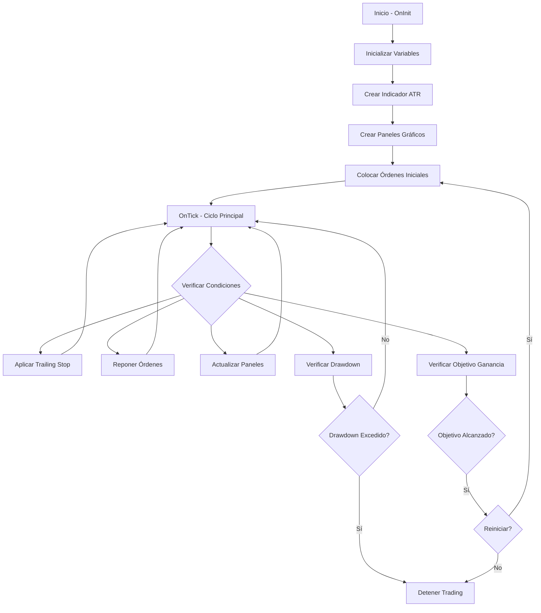
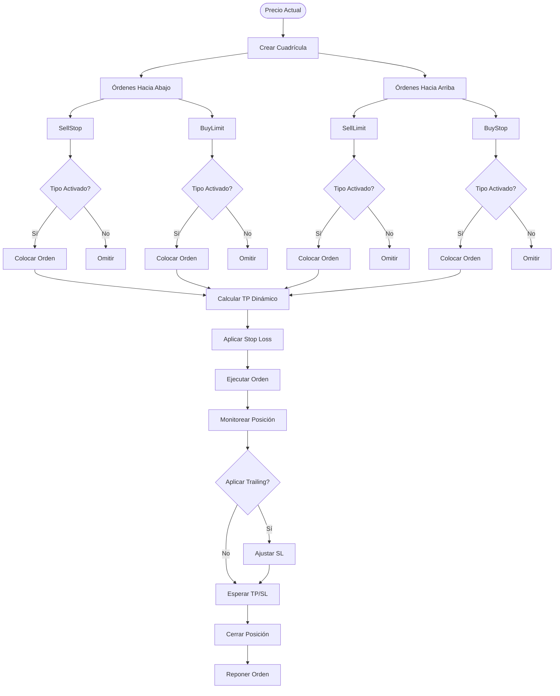
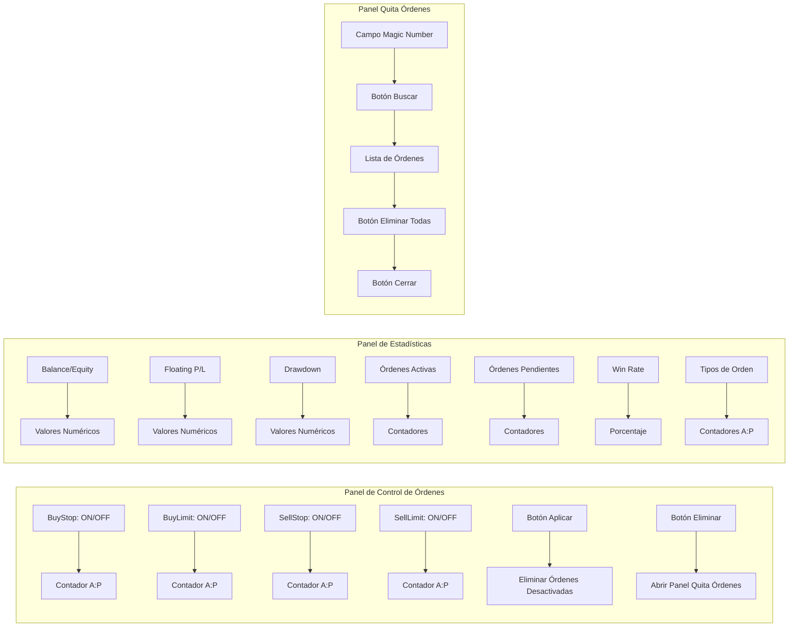
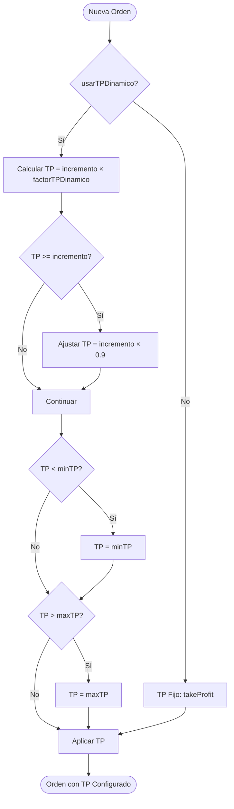
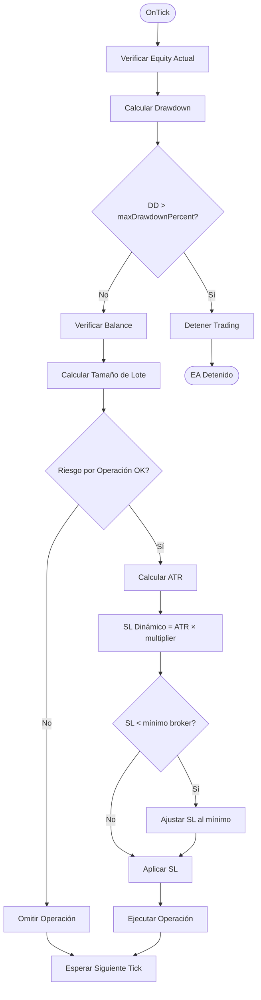

# Dejavu EA - Expert Advisor para MetaTrader 5

## 📋 Descripción General

**Dejavu** es un Expert Advisor (EA) avanzado para MetaTrader 5 que implementa una estrategia de **Grid Trading** con múltiples funcionalidades de gestión de riesgos y control en tiempo real. El bot está diseñado para operar de forma automatizada colocando órdenes pendientes en una cuadrícula alrededor del precio actual.

### 🎯 Características Principales

- ✅ **Grid Trading**: Coloca órdenes pendientes en una cuadrícula con incrementos configurables
- ✅ **Take Profit Dinámico**: Se ajusta automáticamente según el incremento entre órdenes
- ✅ **Trailing Stop**: Ajusta el Stop Loss cuando el precio se mueve a favor
- ✅ **Panel de Control Gráfico**: Interfaz visual para activar/desactivar tipos de órdenes
- ✅ **Gestión de Riesgos Avanzada**: Control de drawdown, tamaño de lote basado en riesgo, SL dinámico con ATR
- ✅ **Estadísticas en Tiempo Real**: Panel informativo con métricas de rendimiento
- ✅ **Eliminación de Órdenes por Magic Number**: Herramienta para gestionar órdenes específicas

---

## 🏗️ Arquitectura del Sistema



---

## 📊 Flujo de Operación del Grid Trading



---

## 🎛️ Estructura de Paneles Gráficos



---

## ⚙️ Parámetros de Configuración

### 📈 Gestión de Riesgos

| Parámetro | Descripción | Valor por Defecto |
|-----------|-------------|-------------------|
| `stopLoss` | Stop Loss en puntos | 9000 |
| `takeProfit` | Take Profit en puntos | 2000 |
| `maxDrawdownPercent` | Máximo drawdown permitido (%) | 20 |
| `riskPerTrade` | Riesgo por operación (%) | 2 |
| `dynamicSLMultiplier` | Multiplicador para SL dinámico (ATR) | 1.5 |
| `atrPeriod` | Periodo para cálculo del ATR | 14 |

### 📊 Configuración de Trading

| Parámetro | Descripción | Valor por Defecto |
|-----------|-------------|-------------------|
| `tpinverso` | Take Profit para órdenes inversas (puntos) | 2000 |
| `slinverso` | Stop Loss para órdenes inversas (puntos) | 9000 |
| `incremento` | Incremento entre órdenes en la cuadrícula (puntos) | 15 |
| `cantidadDeOperaciones` | Cantidad máxima de operaciones por dirección | 50 |
| `cantidadDeGanancia` | Objetivo de ganancia total (puntos) | 20000 |
| `reiniciarPrograma` | Reiniciar después de alcanzar objetivo | true |

### 🎯 Tipos de Órdenes (Activación Inicial)

| Parámetro | Descripción | Valor por Defecto |
|-----------|-------------|-------------------|
| `tBuyStop` | Activar órdenes BuyStop | false |
| `tBuyLimit` | Activar órdenes BuyLimit | true |
| `tSellStop` | Activar órdenes SellStop | false |
| `tSellLimit` | Activar órdenes SellLimit | true |

### 💰 Take Profit Dinámico

| Parámetro | Descripción | Valor por Defecto |
|-----------|-------------|-------------------|
| `usarTPDinamico` | Activar Take Profit dinámico | true |
| `factorTPDinamico` | Factor multiplicador (0.6 = 60% del incremento) | 0.6 |
| `minTP` | TP mínimo permitido (puntos) | 100 |
| `maxTP` | TP máximo permitido (puntos) | 5000 |

### 🎢 Trailing Stop

| Parámetro | Descripción | Valor por Defecto |
|-----------|-------------|-------------------|
| `activarTrailingStop` | Activar Trailing Stop | true |
| `trailingStopPuntos` | Distancia del Trailing Stop (puntos) | 500 |
| `trailingStep` | Paso mínimo para mover el SL (puntos) | 100 |

---

## 🔄 Lógica de Take Profit Dinámico



---

## 🛡️ Sistema de Gestión de Riesgos



---

## 📱 Interfaz de Usuario

### Panel de Control de Órdenes

El panel de control permite activar/desactivar tipos de órdenes en tiempo real:

1. **Ubicación**: Esquina superior izquierda del gráfico
2. **Funcionalidades**:
   - Toggle ON/OFF para cada tipo de orden (BuyStop, BuyLimit, SellStop, SellLimit)
   - Contadores en tiempo real: Activas (A) y Pendientes (P)
   - Botón "Aplicar": Elimina órdenes desactivadas y coloca nuevas si están activadas
   - Botón "Eliminar": Abre el panel de eliminación de órdenes

### Panel de Estadísticas

Muestra información en tiempo real sobre el estado del EA:

- **Balance y Equity**: Estado actual de la cuenta
- **Floating P/L**: Ganancia/pérdida flotante
- **Drawdown**: Drawdown actual en porcentaje
- **Órdenes Activas**: Contador de posiciones abiertas (Buy/Sell)
- **Órdenes Pendientes**: Contador de órdenes pendientes (Buy/Sell)
- **Total Profit**: Ganancia total acumulada
- **Win Rate**: Porcentaje de operaciones ganadoras
- **Risk Level**: Nivel de riesgo actual
- **Contadores por Tipo**: Activas y Pendientes para cada tipo de orden

### Panel de Eliminación de Órdenes

Herramienta para gestionar órdenes por Magic Number:

1. **Buscar**: Lista todas las órdenes (activas y pendientes) con un Magic Number específico
2. **Eliminar Todas**: Elimina todas las órdenes encontradas (con confirmación)
3. **Cerrar**: Cierra el panel

---

## 🔧 Instalación y Uso

### Requisitos

- MetaTrader 5 instalado
- Cuenta de trading (recomendado: cuenta demo para pruebas)
- Archivo `Dejavu.mq5` compilado

### Instalación

1. Copia el archivo `Dejavu.mq5` a la carpeta:
   ```
   MetaTrader 5/MQL5/Experts/
   ```

2. Abre MetaEditor (F4 en MT5)

3. Compila el archivo (F7)

4. Verifica que no haya errores en la pestaña "Errors"

### Uso Básico

1. **Abrir el gráfico** del instrumento deseado (ej: USDCHF)

2. **Arrastrar el EA** desde el Navigator al gráfico

3. **Configurar parámetros** en la ventana que se abre:
   - Ajusta los parámetros según tu estrategia
   - Activa/desactiva tipos de órdenes según prefieras

4. **Activar AutoTrading** (botón en la barra de herramientas)

5. **Monitorear** los paneles gráficos para ver el estado en tiempo real

### Uso Avanzado

#### Cambiar Incremento Dinámicamente

El EA puede leer el incremento desde un archivo de texto:

1. Crea un archivo `incremento.txt` en la carpeta `MQL5/Files/`
2. Escribe solo el número (ej: `20`)
3. El EA leerá este valor al iniciar

#### Control en Tiempo Real

- Usa el **Panel de Control** para activar/desactivar tipos de órdenes sin reiniciar el EA
- Presiona "Aplicar" después de hacer cambios
- Los contadores se actualizan automáticamente

---

## 📈 Estrategia de Grid Trading

### Concepto

El Grid Trading coloca órdenes pendientes en una cuadrícula alrededor del precio actual:

```
Precio Actual: 1.2000

SellLimit:  1.2015  ← Incremento: +15
SellLimit:  1.2030  ← Incremento: +30
SellLimit:  1.2045  ← Incremento: +45
───────────────────
Precio:     1.2000  ← Precio Actual
───────────────────
BuyLimit:   1.1985  ← Incremento: -15
BuyLimit:   1.1970  ← Incremento: -30
BuyLimit:   1.1955  ← Incremento: -45
```

### Tipos de Órdenes

- **BuyStop**: Se activa cuando el precio sube (breakout alcista)
- **BuyLimit**: Se activa cuando el precio baja (compra en soporte)
- **SellStop**: Se activa cuando el precio baja (breakout bajista)
- **SellLimit**: Se activa cuando el precio sube (venta en resistencia)

### Incremento Progresivo

Cada 15 órdenes, el incremento aumenta en 5 puntos:

```
Órdenes 1-15:   incremento = 15 puntos
Órdenes 16-30:  incremento = 20 puntos
Órdenes 31-45:  incremento = 25 puntos
...
```

---

## 🎯 Take Profit Dinámico

El Take Profit se calcula automáticamente basándose en el incremento:

```mql5
TP = incremento × factorTPDinamico
```

**Ejemplo:**
- Incremento: 15 puntos
- Factor: 0.6
- TP calculado: 15 × 0.6 = 9 puntos

**Restricciones:**
- El TP siempre será menor al incremento (máximo 90%)
- Se aplican límites mínimo (minTP) y máximo (maxTP)

---

## 🎢 Trailing Stop

El Trailing Stop ajusta automáticamente el Stop Loss cuando el precio se mueve a favor:

**Funcionamiento:**
1. Si el precio se mueve a favor de la posición
2. Y la distancia es mayor a `trailingStopPuntos`
3. Y el movimiento es mayor a `trailingStep`
4. Entonces el SL se ajusta automáticamente

**Ejemplo:**
- Posición BUY abierta en 1.2000
- SL inicial: 1.1950
- Precio actual: 1.2050
- Trailing Stop: 500 puntos
- Nuevo SL: 1.2000 (1.2050 - 500)

---

## 🛡️ Gestión de Riesgos

### Control de Drawdown

El EA monitorea constantemente el drawdown:

```mql5
drawdown = (highestEquity - currentEquity) / highestEquity × 100
```

Si el drawdown excede `maxDrawdownPercent`, el EA detiene el trading.

### Tamaño de Lote Basado en Riesgo

El tamaño del lote se calcula según el riesgo por operación:

```mql5
lot = (balance × riskPerTrade / 100) / (stopLoss × point × contractSize)
```

### Stop Loss Dinámico (ATR)

El Stop Loss se puede calcular dinámicamente usando el ATR:

```mql5
ATR = iATR(Symbol(), Period(), atrPeriod)
SL = ATR × dynamicSLMultiplier
```

---

## 🔄 Flujo de Reposición de Órdenes


---

## 📊 Magic Number

Cada sesión del EA usa un Magic Number único para identificar sus órdenes:

- **Rango**: 10000 - 60000
- **Generación**: Se genera automáticamente al iniciar
- **Persistencia**: Se mantiene durante toda la sesión
- **Limpieza**: Al reiniciar, se eliminan órdenes del Magic Number anterior

---

## ⚠️ Consideraciones Importantes

### Riesgos

- ⚠️ El Grid Trading puede generar múltiples posiciones simultáneas
- ⚠️ Requiere suficiente margen disponible
- ⚠️ En mercados con tendencia fuerte, puede generar pérdidas acumuladas
- ⚠️ Siempre prueba en cuenta demo antes de usar en cuenta real

### Recomendaciones

- ✅ Usa stop loss adecuados
- ✅ Monitorea el drawdown constantemente
- ✅ Ajusta el incremento según la volatilidad del instrumento
- ✅ No uses en instrumentos con spreads muy altos
- ✅ Considera el costo de swap para operaciones overnight

### Limitaciones

- El EA no puede modificar órdenes ya colocadas (solo eliminar y crear nuevas)
- Los cambios en parámetros requieren reiniciar el EA (excepto tipos de órdenes)
- El panel de eliminación solo muestra órdenes del Magic Number actual

---

## 🐛 Solución de Problemas

### El EA no coloca órdenes

1. Verifica que AutoTrading esté activado
2. Revisa que los tipos de órdenes estén activados en el panel de control
3. Verifica que haya suficiente margen
4. Revisa la pestaña "Experts" para mensajes de error

### Las órdenes se eliminan solas

1. Verifica que no hayas desactivado un tipo de orden y presionado "Aplicar"
2. Revisa si el drawdown máximo fue excedido
3. Verifica que el Magic Number sea correcto

### El panel no se muestra

1. Verifica que el EA esté activo en el gráfico
2. Intenta mover el gráfico o cambiar de timeframe
3. Reinicia el EA

---

## 📝 Changelog

### Versión 2.00
- ✅ Panel de control gráfico para activar/desactivar tipos de órdenes
- ✅ Panel de estadísticas en tiempo real
- ✅ Panel de eliminación de órdenes por Magic Number
- ✅ Take Profit dinámico basado en incremento
- ✅ Trailing Stop automático
- ✅ Gestión de riesgos avanzada con ATR
- ✅ Contadores de órdenes por tipo
- ✅ Interfaz gráfica mejorada y alineada

---

## 📞 Soporte

Para reportar problemas o sugerencias:
- Revisa la pestaña "Experts" en MT5 para mensajes de error
- Verifica los logs en la pestaña "Journal"
- Consulta la documentación de MQL5: https://www.mql5.com/en/docs

---

## 📄 Licencia

Copyright 2024, MetaQuotes Ltd.
https://www.mql5.com

---

## 🙏 Agradecimientos

Este EA fue desarrollado como una herramienta educativa y de trading automatizado. Úsalo bajo tu propio riesgo y siempre prueba en cuenta demo antes de usar en cuenta real.

---

**⚠️ ADVERTENCIA**: El trading conlleva riesgos. Este EA es una herramienta y no garantiza ganancias. Siempre usa gestión de riesgos adecuada y nunca arriesgues más de lo que puedes permitirte perder.

