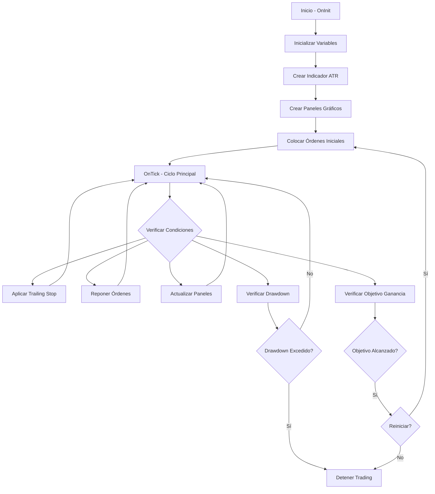
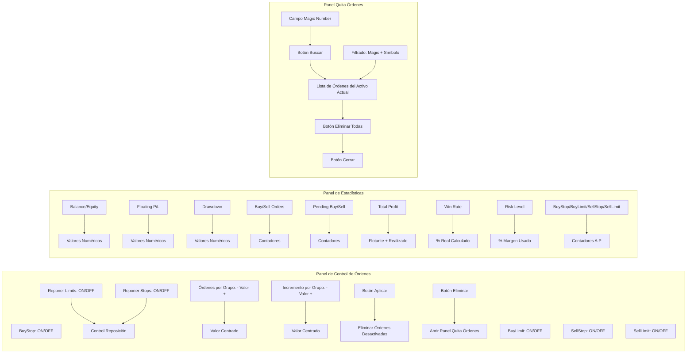
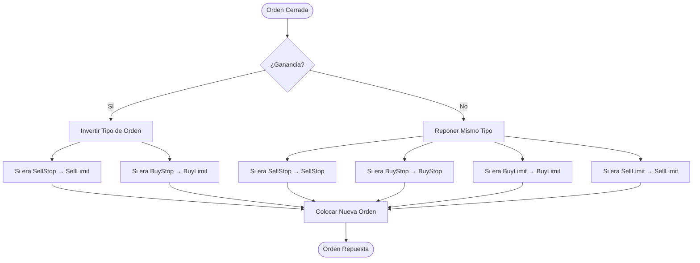

# Dejavu EA - Expert Advisor para MetaTrader 5

## 📋 Descripción General

**Dejavu** es un Expert Advisor (EA) avanzado para MetaTrader 5 que implementa una estrategia de **Grid Trading** con múltiples funcionalidades de gestión de riesgos y control en tiempo real. El bot está diseñado para operar de forma automatizada colocando órdenes pendientes en una cuadrícula alrededor del precio actual.

### 🎯 Características Principales

- ✅ **Grid Trading**: Coloca órdenes pendientes en una cuadrícula con incrementos configurables
- ✅ **Take Profit Dinámico**: Se ajusta automáticamente según el incremento entre órdenes
- ✅ **Trailing Stop**: Ajusta el Stop Loss cuando el precio se mueve a favor
- ✅ **Panel de Control Gráfico**: Interfaz visual para activar/desactivar tipos de órdenes
- ✅ **Control de Reposición**: Activar/desactivar reposición de límites y stops independientemente
- ✅ **Configuración Dinámica**: Modificar órdenes por grupo e incremento por grupo en tiempo real
- ✅ **Gestión de Riesgos Avanzada**: Control de drawdown, tamaño de lote basado en riesgo, SL dinámico con ATR
- ✅ **Estadísticas en Tiempo Real**: Panel informativo con métricas de rendimiento
- ✅ **Eliminación de Órdenes por Magic Number**: Herramienta para gestionar órdenes específicas con filtrado por activo
- ✅ **Multi-Instancia**: Soporte para ejecutar múltiples bots en diferentes activos simultáneamente
- ✅ **Protección de Órdenes**: Las órdenes se mantienen al cambiar temporalidad o reiniciar el bot

---

## 🏗️ Arquitectura del Sistema



---

## 📊 Flujo de Operación del Grid Trading


---

## 🎛️ Estructura de Paneles Gráficos



---

## ⚙️ Parámetros de Configuración

### 📈 Gestión de Riesgos

| Parámetro | Descripción | Valor por Defecto |
|-----------|-------------|-------------------|
| `stopLoss` | Stop Loss en puntos | 9000 |
| `takeProfit` | Take Profit en puntos | 2000 |
| `maxDrawdownPercent` | Máximo drawdown permitido (%) | 20 |
| `riskPerTrade` | Riesgo por operación (%) | 2 |
| `dynamicSLMultiplier` | Multiplicador para SL dinámico (ATR) | 1.5 |
| `atrPeriod` | Periodo para cálculo del ATR | 14 |

### 📊 Configuración de Trading

| Parámetro | Descripción | Valor por Defecto |
|-----------|-------------|-------------------|
| `tpinverso` | Take Profit para órdenes inversas (puntos) | 2000 |
| `slinverso` | Stop Loss para órdenes inversas (puntos) | 9000 |
| `incremento` | Incremento entre órdenes en la cuadrícula (puntos) | 15 |
| `cantidadDeOperaciones` | Cantidad máxima de operaciones por dirección | 50 |
| `cantidadDeGanancia` | Objetivo de ganancia total (puntos) | 20000 |
| `reiniciarPrograma` | Reiniciar después de alcanzar objetivo | true |

### 🔄 Control de Reposición

| Parámetro | Descripción | Valor por Defecto |
|-----------|-------------|-------------------|
| `reponerLimits` | Activar reposición de órdenes Limit | true |
| `reponerStops` | Activar reposición de órdenes Stop | true |
| `ordenesPorGrupo` | Cantidad de órdenes antes de aumentar incremento | 15 |
| `incrementoPorGrupo` | Incremento adicional por grupo de órdenes | 5 |

### 🎯 Tipos de Órdenes (Activación Inicial)

| Parámetro | Descripción | Valor por Defecto |
|-----------|-------------|-------------------|
| `tBuyStop` | Activar órdenes BuyStop | false |
| `tBuyLimit` | Activar órdenes BuyLimit | true |
| `tSellStop` | Activar órdenes SellStop | false |
| `tSellLimit` | Activar órdenes SellLimit | true |

### 💰 Take Profit Dinámico

| Parámetro | Descripción | Valor por Defecto |
|-----------|-------------|-------------------|
| `usarTPDinamico` | Activar Take Profit dinámico | true |
| `factorTPDinamico` | Factor multiplicador (0.6 = 60% del incremento) | 0.6 |
| `minTP` | TP mínimo permitido (puntos) | 100 |
| `maxTP` | TP máximo permitido (puntos) | 5000 |

### 🎢 Trailing Stop

| Parámetro | Descripción | Valor por Defecto |
|-----------|-------------|-------------------|
| `activarTrailingStop` | Activar Trailing Stop | true |
| `trailingStopPuntos` | Distancia del Trailing Stop (puntos) | 500 |
| `trailingStep` | Paso mínimo para mover el SL (puntos) | 100 |

---

## 🔄 Lógica de Take Profit Dinámico


---

## 🛡️ Sistema de Gestión de Riesgos


---

## 📱 Interfaz de Usuario

### Panel de Control de Órdenes

El panel de control permite activar/desactivar tipos de órdenes en tiempo real:

1. **Ubicación**: Esquina superior izquierda del gráfico
2. **Funcionalidades**:
   - **Toggle ON/OFF** para cada tipo de orden (BuyStop, BuyLimit, SellStop, SellLimit)
   - **Control de Reposición**:
     - Toggle "Reponer Limits": Activa/desactiva reposición de órdenes Limit
     - Toggle "Reponer Stops": Activa/desactiva reposición de órdenes Stop
   - **Configuración de Grupos** (modificable en tiempo real con botones +/-):
     - **Órdenes por Grupo**: Cantidad de órdenes antes de aumentar el incremento (valores centrados entre botones)
     - **Incremento por Grupo**: Incremento adicional por grupo (valores centrados entre botones)
   - **Botón "Aplicar"**: Elimina órdenes desactivadas y coloca nuevas si están activadas
   - **Botón "Eliminar"**: Abre el panel de eliminación de órdenes
   
   **Nota**: Los contadores A:P (Activas/Pendientes) solo se muestran en el panel de estadísticas, no en este panel.

### Panel de Estadísticas

Muestra información en tiempo real sobre el estado del EA:

- **Balance y Equity**: Estado actual de la cuenta
- **Floating P/L**: Ganancia/pérdida flotante (diferencia entre Equity y Balance)
- **Drawdown**: Drawdown actual en porcentaje
- **Buy Orders / Sell Orders**: Contador de posiciones abiertas (solo del activo actual)
- **Pending Buy / Pending Sell**: Contador de órdenes pendientes (solo del activo actual)
- **Total Profit**: **Profit total real** = Profit flotante (posiciones abiertas) + Profit realizado (posiciones cerradas)
- **Win Rate**: **Porcentaje real de operaciones ganadoras** del bot en el activo actual, calculado desde el inicio de la sesión
- **Risk Level**: **Riesgo real calculado** = (Margen usado / Balance) × 100, muestra el porcentaje del balance comprometido como margen
- **Contadores por Tipo**: Activas (A) y Pendientes (P) para cada tipo de orden (BuyStop, BuyLimit, SellStop, SellLimit)
  - **Activas (A)**: Posiciones abiertas identificadas por tipo original usando historial de deals
  - **Pendientes (P)**: Órdenes pendientes contadas directamente por tipo

### Panel de Eliminación de Órdenes

Herramienta para gestionar órdenes por Magic Number con filtrado por activo:

1. **Buscar**: Lista todas las órdenes (activas y pendientes) con un Magic Number específico **del activo actual**
2. **Eliminar Todas**: Elimina todas las órdenes encontradas del activo actual (con confirmación)
3. **Cerrar**: Cierra el panel

**Características de Seguridad**:
- ✅ **Filtrado por Símbolo**: Solo muestra y elimina órdenes del activo donde está corriendo el bot
- ✅ **Multi-Instancia Segura**: Puedes ejecutar múltiples bots en diferentes activos sin interferencias
- ✅ **Protección de Datos**: Cada bot solo gestiona sus propias órdenes, incluso si comparten Magic Number

---

## 🔧 Instalación y Uso

### Requisitos

- MetaTrader 5 instalado
- Cuenta de trading (recomendado: cuenta demo para pruebas)
- Archivo `Dejavu.mq5` compilado

### Instalación

1. Copia el archivo `Dejavu.mq5` a la carpeta:
   ```
   MetaTrader 5/MQL5/Experts/
   ```

2. Abre MetaEditor (F4 en MT5)

3. Compila el archivo (F7)

4. Verifica que no haya errores en la pestaña "Errors"

### Uso Básico

1. **Abrir el gráfico** del instrumento deseado (ej: USDCHF)

2. **Arrastrar el EA** desde el Navigator al gráfico

3. **Configurar parámetros** en la ventana que se abre:
   - Ajusta los parámetros según tu estrategia
   - Activa/desactiva tipos de órdenes según prefieras

4. **Activar AutoTrading** (botón en la barra de herramientas)

5. **Monitorear** los paneles gráficos para ver el estado en tiempo real

### Uso Avanzado

#### Cambiar Incremento Dinámicamente

El EA puede leer el incremento desde un archivo de texto:

1. Crea un archivo `incremento.txt` en la carpeta `MQL5/Files/`
2. Escribe solo el número (ej: `20`)
3. El EA leerá este valor al iniciar

#### Control en Tiempo Real

- Usa el **Panel de Control** para activar/desactivar tipos de órdenes sin reiniciar el EA
- **Modificar Configuración de Grupos**:
  - Haz clic en los botones **+/-** junto a "Órdenes por Grupo" para ajustar la cantidad
  - Haz clic en los botones **+/-** junto a "Incremento por Grupo" para ajustar el incremento
  - Los cambios se aplican inmediatamente (no requiere presionar "Aplicar")
- **Control de Reposición**:
  - Activa/desactiva la reposición de Limits y Stops independientemente
  - Los cambios se aplican inmediatamente
- Presiona "Aplicar" después de cambiar tipos de órdenes
- Los contadores se actualizan automáticamente

#### Ejecutar Múltiples Bots

Puedes ejecutar el bot en diferentes activos simultáneamente:

1. **Abre múltiples gráficos** con diferentes instrumentos (ej: EURUSD, GBPUSD, USDJPY)
2. **Arrastra el EA** a cada gráfico
3. **Configura parámetros** específicos para cada activo si es necesario
4. **Cada bot funciona independientemente**:
   - Tiene su propio Magic Number
   - Solo gestiona órdenes de su activo
   - Los paneles muestran información específica de cada activo
5. **Eliminación segura**: El panel de eliminar órdenes solo afecta al activo del bot actual

---

## 📈 Estrategia de Grid Trading

### Concepto

El Grid Trading coloca órdenes pendientes en una cuadrícula alrededor del precio actual:

```
Precio Actual: 1.2000

SellLimit:  1.2015  ← Incremento: +15
SellLimit:  1.2030  ← Incremento: +30
SellLimit:  1.2045  ← Incremento: +45
───────────────────
Precio:     1.2000  ← Precio Actual
───────────────────
BuyLimit:   1.1985  ← Incremento: -15
BuyLimit:   1.1970  ← Incremento: -30
BuyLimit:   1.1955  ← Incremento: -45
```

### Tipos de Órdenes

- **BuyStop**: Se activa cuando el precio sube (breakout alcista)
- **BuyLimit**: Se activa cuando el precio baja (compra en soporte)
- **SellStop**: Se activa cuando el precio baja (breakout bajista)
- **SellLimit**: Se activa cuando el precio sube (venta en resistencia)

### Incremento Progresivo

El incremento aumenta progresivamente según la configuración de grupos:

**Configuración por defecto:**
- `ordenesPorGrupo`: 15 órdenes
- `incrementoPorGrupo`: 5 puntos

**Ejemplo:**
```
Órdenes 1-15:   incremento = 15 puntos (base)
Órdenes 16-30:  incremento = 20 puntos (15 + 5)
Órdenes 31-45:  incremento = 25 puntos (15 + 10)
Órdenes 46-60:  incremento = 30 puntos (15 + 15)
...
```

**Modificación en Tiempo Real:**
- Puedes cambiar `ordenesPorGrupo` e `incrementoPorGrupo` desde el panel de control
- Usa los botones +/- para ajustar los valores
- Los cambios se aplican a las nuevas órdenes que se coloquen

---

## 🎯 Take Profit Dinámico

El Take Profit se calcula automáticamente basándose en el incremento:

```mql5
TP = incremento × factorTPDinamico
```

**Ejemplo:**
- Incremento: 15 puntos
- Factor: 0.6
- TP calculado: 15 × 0.6 = 9 puntos

**Restricciones:**
- El TP siempre será menor al incremento (máximo 90%)
- Se aplican límites mínimo (minTP) y máximo (maxTP)

---

## 🎢 Trailing Stop

El Trailing Stop ajusta automáticamente el Stop Loss cuando el precio se mueve a favor:

**Funcionamiento:**
1. Si el precio se mueve a favor de la posición
2. Y la distancia es mayor a `trailingStopPuntos`
3. Y el movimiento es mayor a `trailingStep`
4. Entonces el SL se ajusta automáticamente

**Ejemplo:**
- Posición BUY abierta en 1.2000
- SL inicial: 1.1950
- Precio actual: 1.2050
- Trailing Stop: 500 puntos
- Nuevo SL: 1.2000 (1.2050 - 500)

---

## 🔒 Protección y Multi-Instancia

### Protección de Órdenes

El bot incluye múltiples mecanismos de protección para preservar tus órdenes:

1. **Protección al Cambiar Temporalidad**:
   - Al cambiar de timeframe (H1 → H4, etc.), las órdenes se mantienen
   - Solo se limpian los objetos gráficos del panel
   - El bot continúa funcionando en el nuevo timeframe

2. **Protección al Iniciar**:
   - Al colocar el bot en un gráfico, NO elimina órdenes existentes
   - Respeta órdenes manuales y de otros bots
   - Solo gestiona sus propias órdenes (identificadas por Magic Number + Símbolo)

3. **Filtrado por Activo**:
   - Todas las operaciones filtran por símbolo (activo)
   - Cada bot solo ve y gestiona órdenes de su activo
   - Eliminación segura: solo afecta al activo del bot actual

### Ejecutar Múltiples Instancias

**Escenario de Uso:**
- Bot 1 en EURUSD con Magic Number 12345
- Bot 2 en GBPUSD con Magic Number 12345 (mismo número)
- Bot 3 en USDJPY con Magic Number 67890

**Comportamiento:**
- ✅ Cada bot funciona independientemente
- ✅ Cada bot solo gestiona órdenes de su activo
- ✅ Los paneles muestran información específica de cada activo
- ✅ La eliminación de órdenes solo afecta al activo del bot actual
- ✅ No hay interferencias entre bots

**Ejemplo Práctico:**
```
Bot EURUSD:
  - Magic: 12345
  - Símbolo: EURUSD
  - Panel muestra: "Órdenes encontradas (EURUSD)"
  - Elimina solo órdenes EURUSD con magic 12345

Bot GBPUSD:
  - Magic: 12345 (mismo número)
  - Símbolo: GBPUSD
  - Panel muestra: "Órdenes encontradas (GBPUSD)"
  - Elimina solo órdenes GBPUSD con magic 12345
  - NO afecta órdenes de EURUSD
```

---

## 🛡️ Gestión de Riesgos

### Control de Drawdown

El EA monitorea constantemente el drawdown:

```mql5
drawdown = (highestEquity - currentEquity) / highestEquity × 100
```

Si el drawdown excede `maxDrawdownPercent`, el EA detiene el trading.

### Tamaño de Lote Basado en Riesgo

El tamaño del lote se calcula según el riesgo por operación:

```mql5
lot = (balance × riskPerTrade / 100) / (stopLoss × point × contractSize)
```

### Stop Loss Dinámico (ATR)

El Stop Loss se puede calcular dinámicamente usando el ATR:

```mql5
ATR = iATR(Symbol(), Period(), atrPeriod)
SL = ATR × dynamicSLMultiplier
```

### Métricas de Rendimiento en Tiempo Real

El panel de estadísticas calcula métricas precisas:

**Total Profit**:
```mql5
Total Profit = Profit Flotante (posiciones abiertas) + Profit Realizado (posiciones cerradas)
```
- Incluye tanto ganancias/pérdidas flotantes como realizadas
- Filtrado por Magic Number y Símbolo (solo del activo actual)

**Win Rate**:
```mql5
Win Rate = (Operaciones Ganadoras / Total de Operaciones) × 100
```
- Calculado desde el inicio de la sesión (`tiempo_ref`)
- Solo cuenta operaciones del bot actual en el activo actual
- Filtrado por Magic Number y Símbolo

**Risk Level**:
```mql5
Risk Level = (Margen Usado / Balance) × 100
```
- Muestra el porcentaje real del balance comprometido como margen
- Calculado sumando el margen de todas las posiciones abiertas del bot
- No es un parámetro fijo, sino un cálculo dinámico basado en posiciones reales

---

## 🔄 Flujo de Reposición de Órdenes



---

## 📊 Magic Number

Cada sesión del EA usa un Magic Number único para identificar sus órdenes:

- **Rango**: 10000 - 60000
- **Generación**: Se genera automáticamente al iniciar
- **Persistencia**: Se mantiene durante toda la sesión
- **Filtrado por Activo**: Las órdenes se identifican por Magic Number + Símbolo
- **Multi-Instancia**: Cada bot en un activo diferente puede tener su propio Magic Number
- **Protección**: Las órdenes NO se eliminan automáticamente al iniciar o cambiar temporalidad

---

## ⚠️ Consideraciones Importantes

### Riesgos

- ⚠️ El Grid Trading puede generar múltiples posiciones simultáneas
- ⚠️ Requiere suficiente margen disponible
- ⚠️ En mercados con tendencia fuerte, puede generar pérdidas acumuladas
- ⚠️ Siempre prueba en cuenta demo antes de usar en cuenta real

### Recomendaciones

- ✅ Usa stop loss adecuados
- ✅ Monitorea el drawdown constantemente
- ✅ Ajusta el incremento según la volatilidad del instrumento
- ✅ No uses en instrumentos con spreads muy altos
- ✅ Considera el costo de swap para operaciones overnight

### Limitaciones

- El EA no puede modificar órdenes ya colocadas (solo eliminar y crear nuevas)
- Los cambios en parámetros principales requieren reiniciar el EA (excepto tipos de órdenes y configuración de grupos)
- El panel de eliminación solo muestra órdenes del Magic Number actual y del activo actual
- Los contadores A:P solo se muestran en el panel de estadísticas (no en el panel de control)
- La identificación del tipo original de posiciones activas requiere que el historial de deals esté disponible

---

## 🐛 Solución de Problemas

### El EA no coloca órdenes

1. Verifica que AutoTrading esté activado
2. Revisa que los tipos de órdenes estén activados en el panel de control
3. Verifica que haya suficiente margen
4. Revisa la pestaña "Experts" para mensajes de error

### Las órdenes se eliminan solas

1. Verifica que no hayas desactivado un tipo de orden y presionado "Aplicar"
2. Revisa si el drawdown máximo fue excedido
3. Verifica que el Magic Number sea correcto

### El panel no se muestra

1. Verifica que el EA esté activo en el gráfico
2. Intenta mover el gráfico o cambiar de timeframe
3. Reinicia el EA

### Los contadores A:P muestran 0 aunque hay órdenes

1. Verifica que las órdenes tengan el Magic Number correcto del bot
2. Verifica que las órdenes sean del mismo activo donde está corriendo el bot
3. Revisa la pestaña "Journal" para ver si hay advertencias sobre posiciones sin comentario identificable
4. Las posiciones activas requieren historial de deals para identificar el tipo original

### Las métricas (Total Profit, Win Rate, Risk Level) no parecen correctas

1. **Total Profit**: Verifica que incluya tanto profit flotante como realizado
2. **Win Rate**: Se calcula desde el inicio de la sesión, reinicia el EA para resetear
3. **Risk Level**: Debe reflejar el margen real usado, verifica que las posiciones estén abiertas correctamente

---

## 📝 Changelog

### Versión 2.11
- ✅ **Cálculos Mejorados de Métricas**:
  - **Total Profit**: Ahora incluye profit flotante + profit realizado (valores reales)
  - **Win Rate**: Calculado solo para el activo actual, filtrado por Magic Number + Símbolo
  - **Risk Level**: Cálculo real basado en margen usado vs balance (no solo parámetro fijo)
- ✅ **Corrección de Contadores**: Los contadores A:P solo aparecen en el panel de estadísticas
- ✅ **Identificación Mejorada de Tipos**: Las posiciones SELL ya no se identifican incorrectamente como BuyLimit
- ✅ **Conteo Preciso de Órdenes**: Todas las métricas filtran por símbolo para mostrar solo datos del activo actual
- ✅ **Centrado de Valores**: Valores de "Órdenes por Grupo" e "Incremento por Grupo" centrados entre botones +/-

### Versión 2.10
- ✅ **Control de Reposición**: Toggles para activar/desactivar reposición de Limits y Stops
- ✅ **Configuración Dinámica de Grupos**: Botones +/- para modificar órdenes por grupo e incremento por grupo en tiempo real
- ✅ **Protección de Órdenes**: Las órdenes se mantienen al cambiar temporalidad (REASON_CHARTCHANGE)
- ✅ **Protección al Iniciar**: Las órdenes existentes no se eliminan al colocar el bot en el gráfico
- ✅ **Filtrado por Activo**: Panel de eliminación filtra por Magic Number + Símbolo
- ✅ **Multi-Instancia Segura**: Soporte para ejecutar múltiples bots en diferentes activos simultáneamente
- ✅ **Interfaz Mejorada**: Valores de configuración visibles y editables desde el panel

### Versión 2.00
- ✅ Panel de control gráfico para activar/desactivar tipos de órdenes
- ✅ Panel de estadísticas en tiempo real
- ✅ Panel de eliminación de órdenes por Magic Number
- ✅ Take Profit dinámico basado en incremento
- ✅ Trailing Stop automático
- ✅ Gestión de riesgos avanzada con ATR
- ✅ Contadores de órdenes por tipo
- ✅ Interfaz gráfica mejorada y alineada

---

## 📞 Soporte

Para reportar problemas o sugerencias:
- Revisa la pestaña "Experts" en MT5 para mensajes de error
- Verifica los logs en la pestaña "Journal"
- Consulta la documentación de MQL5: https://www.mql5.com/en/docs

---

## 📄 Licencia

Copyright 2024, MetaQuotes Ltd.
https://www.mql5.com

---

## 🙏 Agradecimientos

Este EA fue desarrollado como una herramienta educativa y de trading automatizado. Úsalo bajo tu propio riesgo y siempre prueba en cuenta demo antes de usar en cuenta real.

---

**⚠️ ADVERTENCIA**: El trading conlleva riesgos. Este EA es una herramienta y no garantiza ganancias. Siempre usa gestión de riesgos adecuada y nunca arriesgues más de lo que puedes permitirte perder.

